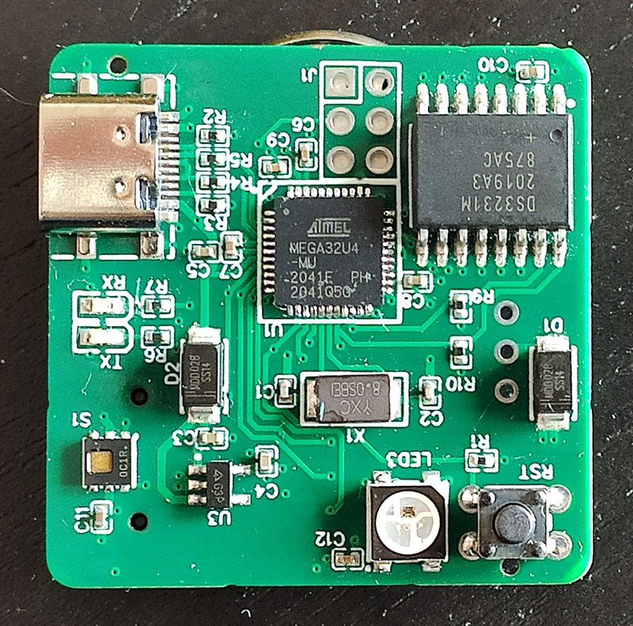
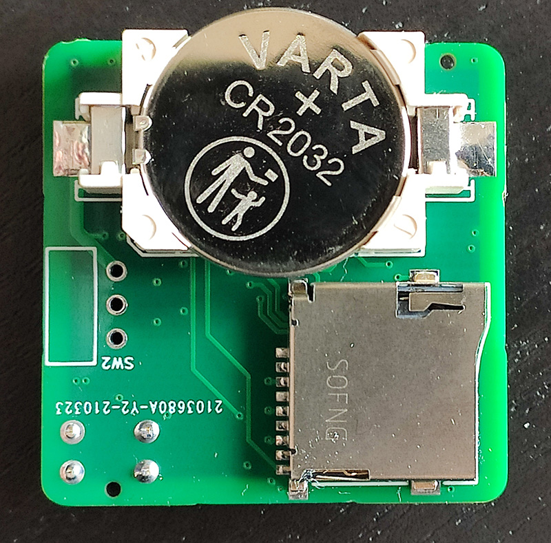

# Arduino Datalogger

A custom data logger based on ATmega32u4 with a custom PCB.

 

The device features the following main components:
* Atmel ATmega32u4 MCU
* Texas Instruments HDC1080 temperature and humidity sensor
* Maxim DS3231 RTC
* WS2812B RGB LED
* microSD card reader
* battery holder for CR2032 coin cell

The coin cell was initially intended for powering the RTC as well as the MCU, but it turns out the SD card doesn't work with the battery voltage.
As such, the 3-positions switch is omitted and the device needs power from the USB port (e.g. with power-bank).
The battery is used for keeping the RTC settings in any case.

The schematics, bill of materials and circuit design can be found [on Open Source Hardware Lab](https://oshwlab.com/krizzli/data-logger-v2).
